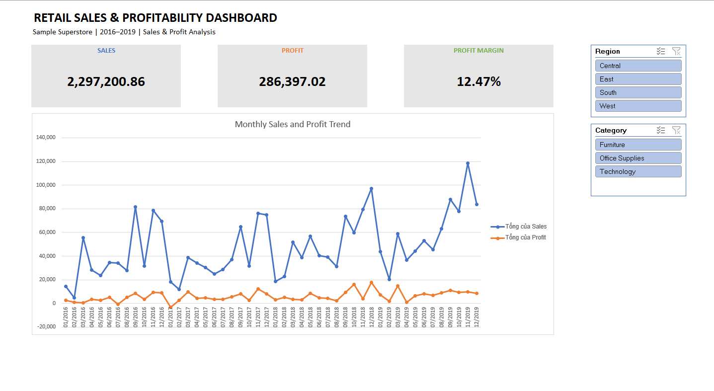
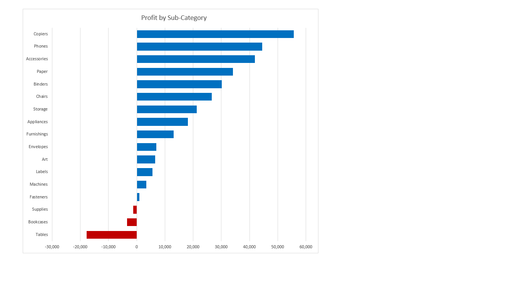

# Retail Sales & Profitability Analysis
### Excel + SQL Server | Sample Superstore | 2016–2019

## Project Overview

This project analyzes retail sales and profitability using the Sample Superstore dataset.

Excel was used to prepare data, build PivotTables, and create an interactive dashboard. SQL Server was used to validate the imported data, compare results with Excel, and investigate loss-making products.

## Business Questions

- Which regions and product sub-categories generate the most profit?
- Which sub-categories report an overall loss?
- How does profitability differ across discount groups for Tables?
- How have sales, profit, and profit margin changed over time?
- Which products have the largest net losses within each region?

## Tools & Skills

| Tool | Skills Applied |
|---|---|
| Microsoft Excel | Excel Tables, XLOOKUP, IF, GETPIVOTDATA, data validation checks, PivotTables, PivotCharts, slicers |
| SQL Server / SSMS | Aggregations, GROUP BY, HAVING, CASE, CTEs, LAG, ROW_NUMBER, NULLIF |
| GitHub | Project documentation and file organization |

## Dataset

- **Dataset:** Sample Superstore
- **Period:** 2016–2019
- **Order lines:** 9,994
- **Distinct orders:** 5,009
- **Units sold:** 37,873

Each row represents a product line within an order. An order can contain multiple rows, so row count and order count are different metrics.

This is a sample dataset used for portfolio practice. Recommendations are based on historical observations.

## Workflow

### 1. Data Preparation in Excel

- Preserved the original data and created an `Orders_Clean` worksheet.
- Added order year, order month, and shipping duration fields.
- Used XLOOKUP to map each region to its regional manager.
- Created discount groups: 0%, 1–20%, >20–40%, and >40%.
- Checked Row ID uniqueness and missing values.
- Retained 11 missing postal codes rather than assigning unsupported values.
- Retained negative profit values because they represent losses.

### 2. Excel Analysis & Dashboard

- Analyzed sales and profit by region, category, and sub-category.
- Calculated annual sales and profit growth.
- Examined Tables profitability by discount group and region.
- Built KPI cards for total sales, total profit, and profit margin.
- Created a monthly sales and profit trend chart.
- Created a profit-by-sub-category chart with losses highlighted in red.
- Connected Region and Category slicers to both dashboard PivotTables.
- Documented findings and recommendations in the Insights worksheet.

### 3. SQL Validation & Analysis

- Imported the cleaned CSV into `dbo.Orders_Clean`.
- Used appropriate numeric, date, and text data types.
- Checked duplicate Row IDs, missing postal codes, shipping dates, and numeric ranges.
- Reconciled row count, distinct orders, sales, profit, and quantity with Excel.
- Analyzed regional and product profitability.
- Used HAVING to identify sub-categories with negative total profit.
- Compared Tables profitability across discount groups.
- Used CTEs and LAG to calculate year-over-year growth.
- Used ROW_NUMBER to identify the five largest net-loss products in each region.

## Overall Results

| Metric | Value |
|---|---:|
| Total Sales | 2,297,200.86 |
| Total Profit | 286,397.02 |
| Profit Margin | 12.47% |
| Distinct Orders | 5,009 |
| Units Sold | 37,873 |

**Profit margin = SUM(Profit) / SUM(Sales) × 100.**

Profit margin is calculated from matching totals, rather than averaging individual row margins.

## Dashboard Preview

### Sales & Profit Overview

### Profit by Sub-Category

## Key Insights

### Regional Performance

- West has the highest sales of **725,457.82** and profit of **108,418.45**.
- West also has the highest regional profit margin at **14.94%**.
- Central has the lowest profit margin at **7.92%**.
- Central generates more sales than South but less profit, showing why sales alone are insufficient to assess performance.

### Product Profitability

- Copiers generate the highest total profit, followed by Phones and Accessories.
- Three sub-categories report negative total profit:

| Sub-Category | Total Profit |
|---|---:|
| Tables | -17,725.48 |
| Bookcases | -3,472.56 |
| Supplies | -1,189.10 |

### Discounts & Tables Profitability

| Discount Group | Total Profit |
|---|---:|
| 0% | 13,276.30 |
| 1–20% | -303.56 |
| >20–40% | -19,589.72 |
| >40% | -11,108.50 |

Tables sold without discounts generate positive total profit, while all discounted groups report negative total profit.

This is an observed association. Differences in product mix, region, and transaction volume may also affect the results. The analysis does not establish discounts as the sole cause of losses.

### Annual Growth

- In 2019, sales increased by **20.36%**, while profit increased by **14.24%** compared with 2018.
- Profit margin declined from **13.43% in 2018** to **12.74% in 2019**.
- Sales growth therefore did not translate into an equivalent rate of profit growth.

### Products Requiring Further Review

SQL analysis identifies the five products with the largest net losses within each region.

The ranking includes both profitable and unprofitable transactions when calculating each product’s total profit. The exported results provide a shortlist for further investigation.

## Business Recommendations

1. Review product mix and discount patterns in Central to understand its lower profit margin.
2. Investigate Tables, Bookcases, and Supplies at product and transaction level.
3. Assess profit margins before setting discount limits for Tables.
4. Review profitable sub-categories for opportunities to expand sales while protecting margins.
5. Monitor sales growth alongside profit growth and profit margin.
6. Use the regional loss rankings to prioritize product-level investigations.

## Repository Contents

| Path | Description |
|---|---|
| `excel/Retail_Sales_Analysis.xlsx` | Excel analysis, interactive dashboard, and insights |
| `data/Orders_Clean.csv` | Cleaned data used for SQL import |
| `sql/retail_sales_analysis.sql` | Database setup, validation, and analysis queries |
| `results/top5_loss_products_by_region.csv` | Exported regional product loss rankings |
| `images/` | Dashboard screenshots |

## How to Explore the Project

### Excel

1. Download `excel/Retail_Sales_Analysis.xlsx`.
2. Open it in an Excel version supporting XLOOKUP and UNIQUE.
3. Open the Dashboard worksheet.
4. Use Region and Category slicers to explore performance.
5. Review the supporting analysis and Insights worksheets.

The Insights worksheet summarizes the full dataset and does not change with dashboard slicer selections.

### SQL Server

1. Open `sql/retail_sales_analysis.sql` in SSMS.
2. Run the database creation section to create `Retail_Sales_Analysis`.
3. Import `data/Orders_Clean.csv` using **Tasks → Import Flat File**.
4. Set the destination table to `dbo.Orders_Clean`.
5. Check the inferred schema before importing:
   - `Row_ID`: `int`, primary key
   - `Sales` and `Profit`: `decimal(18,4)`
   - `Discount`: `decimal(9,4)`
   - `Quantity`: `int`
   - `Postal_Code`: `nvarchar(20)`, nullable
   - `Product_Name`: `nvarchar(500)`
   - Date fields: `date`
6. Run the validation and analysis queries.

Expected reconciliation totals:

| Check | Expected Value |
|---|---:|
| Order Lines | 9,994 |
| Distinct Orders | 5,009 |
| Total Sales | 2,297,200.8603 |
| Total Profit | 286,397.0217 |
| Total Quantity | 37,873 |

## Project Scope

The Excel dashboard and SQL analysis use the same cleaned dataset. SQL results were compared with Excel summaries; the dashboard is not connected directly to SQL Server.

The project focuses on recorded sales and profit. It does not separately model return adjustments or include unrecorded operating costs.
